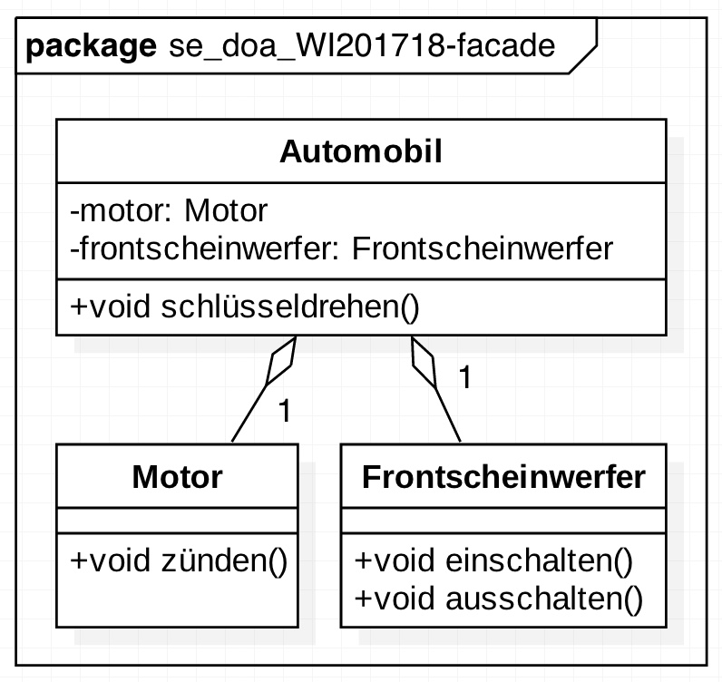
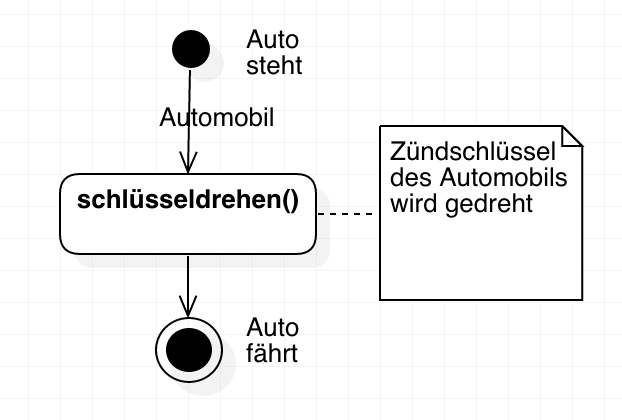
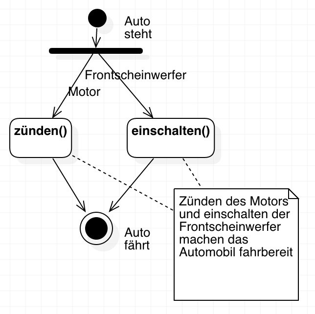

# Beispielcode zum Entwurfsmuster Fassade

Dieses Projekt stellt eine Beispiel-Implementierung in C++ des Entwurfsmusters **Fassade** aus dem Bereich der Softwareentwicklung dar.

## Inhaltsverzeichnis

1. [Komponenten](#komponenten)
    - [Motor](#motor)
    - [Frontscheinwerfer](#frontscheinwerfer)
    - [Automobil](#automobil)
    - [Fahrer](#fahrer)
2. [Ausführung](#ausführung)
    - [Ablaufdiagramm](#ablaufdiagramm)
    - [Voraussetzungen](#voraussetzungen)
    - [Beispielausführung](#beispielausführung)
3. [Referenzen](#referenzen)

## Komponenten



### [Motor](src/Motor.h)

Die Klasse [Motor](src/Motor.h) soll einen mechanischen Motor symbolisieren, welcher durch einen Aufruf der Funktion `Motor::zünden()` zum Starten gebracht werden.

### [Frontscheinwerfer](src/Frontscheinwerfer.h)

Die Klasse [Frontscheinwerfer](src/Frontscheinwerfer.h) ist eine fiktive Komponente, welche durch die Schnittstelle `Frontscheinwerfer::einschalten()` angesprochen werden kann.

### [Automobil](src/Automobil.h)

Die Klasse _Automobil_ soll ein Modell eines Auto symbolisieren, welches durch einen Aufruf der Funktion `Automobil::schlüsseldrehen()` gestartet werden kann. Dieses fiktionale Auto besteht aus mehreren Bestandteilen, unteranderem einem [Motor](#motor) und [Frontscheinwerfer](#frontscheinwerfer). Bim Drehen des Autoschlüssels wird der Motor gezündet und die Frontscheinwerfer werden eingeschaltet.

Die Datenstruktur der Klasse _Automobil_ bildet hier eine Art **Fassade**, bei der die Schnittstellen des _Motors_ (`Motor::zünden()`) und der _Frontscheinwerfer_ (`Frontscheinwerfer::einschalten()`) hinter einer einzelnen Schnittstelle (`Automobil::schlüsseldrehen()`) verborgen wird:

```cpp
#include "Automobil.h"
#include "Motor.h"

void Automobil::schlüsseldrehen() {
    // Zünde den Motor
    motor.zünden();

    // Schalte die Frontscheinwerfer ein
    frontscheinwerfer.einschalten();

    [...]
    // Auto wurde gestartet!
}
```

### [Fahrer](src/Fahrer.h)

Das Fahrer-Modell soll abstrakte Clients simulieren, welche auf verschiedene Zugriffsarten die Komponenten [Motor](#motor) und [Frontscheinwerfer](#frontscheinwerfer) anprechen sowie aktivieren.

#### 1. [Der "manuelle" Fahrer](src/ManuelleFahrer.h)

Der "manuelle" Fahrer spricht die Komponenten [Motor](#motor) und [Frontscheinwerfer](#frontscheinwerfer) direkt an, überprüft deren Status selbst und hat volle Kontrolle über deren Schnittstellen.

```cpp
#include "Fahrer.h"
#include "Motor.h"
#include "Frontscheinwerfer.h"

class ManuellerFahrer : public Fahrer {
private:
    Motor motor;
    Frontscheinwerfer frontscheinwerfer;
public:
    void starten() {
        cout << "ManuellerFahrer: Beginne das Auto zu starten..." << endl;

        // Zünde den Motor
        cout << "ManuellerFahrer: Versuche den Motor zu zünden..." << endl;
        motor.zünden();

        // Schalte die Frontscheinwerfer ein
        cout << "ManuellerFahrer: Versuche die Frontscheinwerfer einzuschalten..." << endl;
        frontscheinwerfer.einschalten();

        // Läuft
        cout << "ManuellerFahrer: Motor und Frontscheinwerfer gestartet!" << endl;
    }
};
```

#### 2. [Der "faule" Fahrer](src/FauleFahrer.h)

Der "faule" Fahrer spricht über die **Fassadenklasse** [Automobil](src/Automobil.h) die Komponenten [Motor](#motor) und [Frontscheinwerfer](#frontscheinwerfer) an, es findet keine direkte Kommunikation zwischen den Schnittstellen statt.

```cpp
#include "Fahrer.h"
#include "Automobil.h"

class FaulerFahrer : public Fahrer {
private:
    Automobil automobil;
public:
    void starten() {
        cout << "FaulerFahrer: Beginne das Auto zu starten..." << endl;

        // Schlüssel drehen
        automobil.schlüsseldrehen();

        // Läuft
        cout << "FaulerFahrer: Motor und Frontscheinwerfer gestartet!" << endl;
    }
};
```

## Ausführung

### Ablaufdiagramm

Ablauf mit Fassade | Ablauf ohne Fassade
--- | ---
 | 

### Voraussetzungen

Ein aktueller C++-Compiler (`g++`) und das GNU Make Tool (`make`) werden vorausgesetzt.

Zu Beginnt wird mit `$ make executable` die Kompilierung des Quellcodes gestartet und im Anschluss die generierten Binaries mit den nötigen Rechten für eine Ausführung versehen.

Zuletzt wird mit `$ make run` die Ausführung gestartet.

### Beispielausführung

```bash
Lukas-MacBook:se_doa_WI201718-facade lukas$ make automobil
g++ -Wall -I./src src/Automobil.cpp src/Frontscheinwerfer.cpp src/Motor.cpp src/main.cpp -o Automobil
chmod +x Automobil
```

```bash
Lukas-MacBook:se_doa_WI201718-facade lukas$ ./Automobil
Versuche das Auto mit Motor und Frontscheinwerfer zu starten...
Versuche den Motor zu zünden...
Motor wurde gezündet.
Versuche die Frontscheinwerfer einzuschalten...
Frontscheinwerfer wurden eingeschaltet.
Auto wurde gestartet!
```

## Referenzen

- [Einsteigerfreundliche Einführung in das Facade Design Pattern](http://www.philipphauer.de/study/se/design-pattern/facade.php)
- [Fassade (Entwurfsmuster)](https://de.wikipedia.org/wiki/Fassade_(Entwurfsmuster))